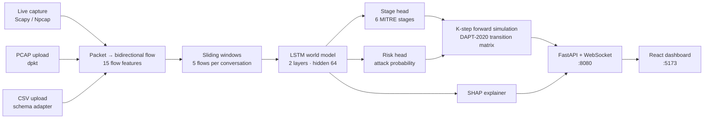

<div align="center">

# 🛡️ CyberForecaster

### AI-Based Network Attack Forecasting from Network Traffic Data

**Smart India Hackathon 2026 · Problem Statement SIH26153 · NTRO**


</div>

---

## 🏷️ Problem statement

| | |
| :--- | :--- |
| **Problem Statement ID** | SIH26153 |
| **Title** | AI-based Network Attack Forecasting from Network Traffic Data |
| **Organization** | National Technical Research Organisation (NTRO) |
| **Theme** | Blockchain & Cybersecurity |
| **Category** | Software |
| **Team** | Ninja · Team ID 143440 |

**The problem.** Conventional intrusion-detection systems are reactive: they flag an attack once it is
already happening. Multi-stage attacks (reconnaissance → initial access → lateral movement → command &
control → exfiltration) unfold over time, so defenders need to know **what the attacker is likely to do
next**, how soon, and why the system thinks so.

---

## 📌 Overview

Most intrusion-detection systems answer *"is this traffic malicious right now?"*.
**CyberForecaster answers *"where is this attack going next?"*** — it learns how network
state evolves over time and forecasts the next **MITRE ATT&CK** stages of an intrusion, with an
infiltration probability for each future step and a **SHAP** explanation of *why*.

It ingests **live packet capture, PCAP files, and flow CSVs**, and all detection, forecasting and
explanation run **locally on a normal laptop CPU** — no cloud service or GPU needed.

| | What it does |
| :--- | :--- |
| 🧠 **World model** | A 2-layer **LSTM** learns network-state dynamics from sequences of 5 flows per conversation and predicts the current stage + attack risk. |
| 🔮 **K-step forecast** | A kill-chain **stage-transition matrix** learned from **DAPT-2020** rolls the state forward *t+1 … t+5*, giving the next MITRE stage and an infiltration probability per step. |
| 🗺️ **MITRE ATT&CK** | 6 stages: Normal → Reconnaissance → Initial Access → Lateral Movement → Command & Control → Exfiltration. |
| 🔍 **Explainable** | **SHAP** (`GradientExplainer`) attributions on the model's risk head show which traffic features drove each prediction — every value on screen is the real SHAP output, measured against real benign traffic. |
| 📥 **Three input paths** | Live capture (Scapy/Npcap) · PCAP upload (dpkt) · CSV upload — including raw **CICFlowMeter** CSVs, auto-converted to the model's schema. |
| 📊 **Benchmarked** | Compared against a logistic-regression baseline on a dataset neither model was trained on ([results](#-results)). |

---

## 🏗️ Architecture



**15 flow features** — `duration, packet_count, byte_count, syn_count, ack_count, fin_count, rst_count,
ttl_mean, ttl_var, win_mean, win_var, frag_ratio, payload_mean, payload_std, retransmit_count`.
The extractor additionally computes **inter-arrival-time statistics** (`iat_mean`, `iat_std`) and the
**bidirectional flow ratio** (`bwd_fwd_ratio`) for every flow.

---

## 🧰 Tech stack

| Layer | Technology |
| :--- | :--- |
| Models | PyTorch (LSTM), scikit-learn (baseline), XGBoost (live per-flow classifier), SHAP |
| Backend | Python, FastAPI, Uvicorn, WebSockets, Scapy, dpkt, pandas, NumPy |
| Frontend | React 19, Vite, Tailwind CSS, Recharts, lucide-react |
| Data | CSE-CIC-IDS-2018, CTU-13, DAPT-2020 (training) · CIC-IDS-2017 (evaluation) |

---

## 🚀 Setup & run

> Every command below must be run **from inside the project folder**. Opening PowerShell / Terminal
> somewhere else and typing `.\start.ps1` gives *"is not recognized"* — `cd` into the folder first.

### Prerequisites

| Requirement | Version | Download |
| :--- | :--- | :--- |
| **Python** | 3.10 or newer | [python.org/downloads](https://www.python.org/downloads/) — on Windows tick **"Add python.exe to PATH"** |
| **Node.js** (includes npm) | 18 or newer (LTS) | [nodejs.org](https://nodejs.org/) |
| **Git** *(optional)* | any | [git-scm.com](https://git-scm.com/downloads) — or use **Code → Download ZIP** on GitHub |
| **Npcap** *(Windows, live capture only)* | latest | [npcap.com](https://npcap.com/#download) — tick **"WinPcap API-compatible Mode"** |

Check them in a new terminal: `python --version` and `node --version`.
PCAP and CSV upload work without Npcap; only live capture needs it (plus Administrator / root rights).

---

### 🪟 Windows

**Step 1 — Get the code**

```powershell
git clone https://github.com/maradiadrashti/cyberforecaster.git
```

*(or download the ZIP from GitHub and extract it, e.g. to `C:\Users\<you>\Downloads\cyberforecaster`)*

**Step 2 — Open PowerShell and go into the project folder**

Press **Start**, type **PowerShell**, open **Windows PowerShell**, then `cd` to where the project is:

```powershell
cd C:\Users\<you>\Downloads\cyberforecaster
```

> Tip: in File Explorer, open the `cyberforecaster` folder, click the address bar, type `powershell`
> and press **Enter** — PowerShell opens already inside the folder.
> Check you are in the right place: `dir` should list `setup.ps1`, `start.ps1` and `requirements.txt`.

**Step 3 — Allow the project scripts to run (this PowerShell window only)**

```powershell
Set-ExecutionPolicy -Scope Process -ExecutionPolicy Bypass
```

Windows blocks `.ps1` scripts by default (*"running scripts is disabled on this system"*). This allows them
only for the current window and changes nothing permanently. Answer **Y** if asked.

**Step 4 — Install everything (first time only, ~5–10 min)**

```powershell
.\setup.ps1
```

This creates a Python virtual environment in `.venv\`, installs the Python packages from
`requirements.txt`, and installs the dashboard packages in `client\`.

**Step 5 — Start CyberForecaster**

```powershell
.\start.ps1
```

`start.ps1` asks for **Administrator** permission (needed for live packet capture) — click **Yes**.
A new window starts the backend and the dashboard and opens **http://127.0.0.1:5173** in your browser.
Keep that window open; press **Enter** in it to stop everything.

**Next time** you only need Steps 2, 3 and 5.

---

### 🐧 Linux / 🍎 macOS

```bash
git clone https://github.com/maradiadrashti/cyberforecaster.git
cd cyberforecaster            # every command below runs from this folder
chmod +x setup.sh start.sh
./setup.sh                    # first time only
sudo ./start.sh               # sudo is needed for live packet capture
```

Then open **http://127.0.0.1:5173**. Press **Ctrl + C** in the terminal to stop.

---

### Manual start (any OS, if you prefer not to use the scripts)

Open **two** terminals, both inside the project folder, after running the setup script once.

```bash
# Terminal 1 — backend / AI engine
#   Windows:      .venv\Scripts\activate
#   Linux/macOS:  source .venv/bin/activate
cd capture-service
python -m uvicorn capture_server:app --host 127.0.0.1 --port 8080
```

```bash
# Terminal 2 — dashboard
cd client
npm run dev
```

| Service | URL |
| :--- | :--- |
| Dashboard | http://127.0.0.1:5173 |
| Backend API | http://127.0.0.1:8080 · interactive docs at http://127.0.0.1:8080/docs |

> The first forecast after start-up takes a few extra seconds while the model and SHAP explainer load.

---

### ▶️ Try it in 60 seconds

1. Open the dashboard → **File Upload**.
2. Upload **`samples/real_sample_v4.csv`** (108 labeled flows, 11 conversations).
3. Open **Attack Forecast** and pick a conversation from the drop-down (sorted by risk).
4. You will see the current security state, the *t+1 … t+5* infiltration-probability forecast,
   the MITRE ATT&CK progression, the SHAP explanation and the flows used as evidence.

More inputs to try are listed in [`samples/`](samples/README.md) — including a raw CICFlowMeter CSV
(auto-converted on upload) and a small PCAP.

---

## 🖥️ Using the dashboard

| Page | What you get |
| :--- | :--- |
| **Live Telemetry** | Pick a network interface and start capture. Shows live traffic rate, protocol split, per-flow classification, and lets you download the captured traffic as **PCAP** or **CSV**. |
| **File Upload** | Upload a `.pcap` / `.pcapng` / `.csv`. Flows are grouped into conversations (src → dst) and every conversation with ≥ 5 flows is scored by the world model. |
| **Attack Forecast** | Per conversation: current security state · risk forecast *t+1 … t+5* · MITRE ATT&CK progression (NOW → forecast) · SHAP feature attributions · observed network evidence. |

---

## 📊 Results

Full method, raw numbers and limitations: **[VALIDATION.md](VALIDATION.md)**.

### LSTM world model vs. logistic-regression baseline — unseen dataset

Both models were evaluated on **CIC-IDS-2017 (Thursday, Web Attacks)** — a different year and a
different network from the training data. Neither model saw it during training. Both received the
**same 15 input features**; the LSTM sees the last 5 flows of a conversation, the baseline sees only
the latest flow. **170,170 windows, 2,176 of them attacks (1.3%).**

| Model | Accuracy | Precision | Recall | F1 | False-positive rate |
| :--- | ---: | ---: | ---: | ---: | ---: |
| **LSTM world model** (risk head) | **99.22%** | **67.3%** | 76.3% | **0.715** | **0.48%** |
| LSTM world model (stage head) | 98.34% | 42.0% | 78.2% | 0.546 | 1.40% |
| Logistic regression baseline | 5.47% | 1.3% | 100% | 0.026 | 95.75% |

- On unseen traffic the per-flow baseline **collapses** — it flags almost every flow as an attack —
  while the LSTM keeps benign traffic quiet (**0.48% false alarms**) and still catches ~3 of 4 attacks.
- The LSTM assigns the **correct MITRE stage (Initial Access)** to **1,702 / 2,176 = 78.2%** of attack windows.
- On its *own* training distribution the baseline is strong (95.7% accuracy, F1 0.959 — see
  `models/logreg_baseline_meta.json`); the gap above is about **generalizing to a new network**.

Saved run: [`evaluation/results/cic2017_webattacks.json`](evaluation/results/cic2017_webattacks.json).

### Learned kill-chain transitions (DAPT-2020)

| From | Most likely next stage | P(next \| current) |
| :--- | :--- | :---: |
| Reconnaissance | Initial Access | 0.77 |
| Initial Access | Lateral Movement | 0.83 |
| Lateral Movement | Exfiltration | 0.50 |

These drive the *t+1 … t+5* forecast. They are learned from **11 real stage transitions across 7
attacker hosts** — directionally correct, but a small sample (see limitations).

---

## ⚠️ Honest limitations

- **Sparse multi-stage data.** Public datasets with genuine per-attacker stage progression are rare;
  DAPT-2020 gives only 11 clean transitions. CIC-IDS-2018 and CTU-13 contain attacks but **no
  multi-stage transitions**. The forecast is directionally right but statistically under-powered.
- **TTL dependency.** The model uses `ttl_mean`. Flow CSVs without TTL (e.g. CICFlowMeter) get a
  default TTL of 64 and the backend logs a warning; with TTL = 0 accuracy drops sharply. PCAP and
  live capture carry real TTL and are unaffected.
- **Very old traffic.** Datasets far outside the 2017–2020 distribution (e.g. DARPA 2000) are not
  reliably detected.
- **Web brute-force** looks like ordinary HTTP at the flow level; that is most of the 22% of
  attack windows the LSTM misses on CIC-IDS-2017.
- **Connectivity.** Analysis is fully local. Only the landing page's 3D scene and the web font are
  loaded from the internet; without internet they simply don't render.

---

## 📂 Repository structure

```
cyberforecaster/
├── capture-service/            FastAPI backend: capture, flow extraction, inference, SHAP
│   ├── capture_server.py         API + WebSocket server (port 8080)
│   ├── extractor/                PCAP → 15-feature flow extractor (+ IAT, bwd/fwd ratio)
│   └── wsl_sniffer.py            optional capture helper for WSL
├── client/                     React + Vite dashboard (port 5173)
│   └── src/pages/                LiveTraffic · UploadAnalysis · AttackForecast · LandingPage
├── models/                     trained artifacts + inference code
│   ├── stage_forecaster_lstm_v1.pth / _meta.json   LSTM world model (≈230 KB)
│   ├── stage_forecaster_lstm_infer.py              loads the model, runs forecasts
│   ├── stage_transition_matrix.json                DAPT-2020 kill-chain matrix
│   ├── shap_background_benign.json                 SHAP reference: 100 real benign windows
│   ├── logreg_baseline_*.joblib / _meta.json       benchmark model
│   └── flow_classifier_*                           XGBoost live per-flow classifier
├── data_prep/                  dataset mapping, labeling, transition-matrix estimation
├── training/                   training scripts (LSTM, baseline, flow classifier)
├── evaluation/                 cross-dataset benchmark, evaluation & explanation scripts
├── samples/                    small ready-to-upload CSV / PCAP files
├── tests/                      API, upload-pipeline and classification tests
├── predict_csv.py              command-line forecast for a flow CSV
├── setup.ps1 / setup.sh        one-time install
├── start.ps1 / start.sh        launch backend + dashboard
├── requirements.txt            Python dependencies
└── VALIDATION.md               evaluation method, results, limitations
```

---

## 🧠 Model details

| | |
| :--- | :--- |
| Architecture | `StageForecasterLSTM` — 2-layer LSTM (hidden 64, dropout 0.3) → stage head (64→32→6, softmax) + risk head (64→16→1, sigmoid) |
| Parameters | ≈ 57 K (model file ≈ 230 KB) |
| Input | 5 consecutive flows × 15 features, log-transformed (skewed counts) + min-max normalized |
| Target | the MITRE stage **3 flows ahead** of the window (forecasting, not just classification) |
| Training | Adam, class-weighted cross-entropy (stage) + BCE (risk), gradient clipping (max-norm 5), early stopping |
| Forecast | Markov roll-out over the DAPT-2020 kill-chain transition matrix, K = 5 steps |
| Explainability | SHAP `GradientExplainer` on the risk head, with 100 **real benign** 5-flow windows from the training data as the reference (`models/shap_background_benign.json`); values averaged over the 5 time-steps |

### Datasets

| Dataset | Used for | Source |
| :--- | :--- | :--- |
| CSE-CIC-IDS-2018 | training (attack vs normal, stages) | [UNB CIC](https://www.unb.ca/cic/datasets/ids-2018.html) |
| CTU-13 | training (real botnet traffic) | [Stratosphere Lab](https://www.stratosphereips.org/datasets-ctu13) |
| DAPT-2020 | training + kill-chain transition matrix | [gitlab.com/asu22/dapt2020](https://gitlab.com/asu22/dapt2020) |
| CIC-IDS-2017 | **held-out evaluation** of the LSTM and the baseline | [UNB CIC](https://www.unb.ca/cic/datasets/ids-2017.html) |

You do **not** need to download any dataset to run CyberForecaster — the trained models are included
in `models/`, so the dashboard works straight after cloning.

> The XGBoost per-flow classifier used for live traffic labels was trained on CIC-IDS-2017; the
> cross-dataset benchmark above evaluates the **LSTM world model** and the baseline, not this classifier.

---

## 🔌 Main API endpoints

| Method | Endpoint | Purpose |
| :--- | :--- | :--- |
| `POST` | `/api/upload` | Upload a PCAP/CSV; runs the world model on every conversation |
| `GET` | `/api/forecast/latest` | Latest per-conversation forecasts (stage, risk, *t+1 … t+5* timeline) |
| `GET` | `/api/explain?src_ip=…&dst_ip=…` | SHAP feature attributions for one conversation |
| `GET` | `/api/interfaces` | Network interfaces available for capture |
| `POST` | `/api/capture/start/{iface}` · `/api/capture/stop/{iface}` | Start / stop live capture |
| `GET` | `/api/capture/export-pcap` · `/api/capture/download` | Download captured traffic |
| `WS` | `/ws/live` | Live flow + forecast stream |

Full, interactive list: http://127.0.0.1:8080/docs once the backend is running.

---

## 🧪 Tests & command-line use

```bash
# forecast a CSV from the command line (no dashboard needed)
python predict_csv.py sample_test_flows.csv

# test suite (run from the repo root with the virtual environment active)
python -m unittest tests.test_upload_pipeline tests.test_file_upload_api -v
```

---

## 🛠️ Troubleshooting

| Problem | Fix |
| :--- | :--- |
| No interfaces / capture won't start (Windows) | Install **Npcap** with *WinPcap API-compatible Mode*, and run `start.ps1` as Administrator. |
| `.\start.ps1 : The term ... is not recognized` | You are not inside the project folder. `cd` into it first (Step 2) — `dir` must show `start.ps1`. |
| *"running scripts is disabled on this system"* | Run `Set-ExecutionPolicy -Scope Process -ExecutionPolicy Bypass` in the same PowerShell window, then retry. |
| `setup.ps1` says Python / Node.js was not found | Install it (see Prerequisites), then open a **new** PowerShell window so the PATH is refreshed. |
| Port 8080 or 5173 already in use | `start.ps1` frees them automatically; otherwise stop the other program or change `VITE_CAPTURE_PORT` in `client/.env` (copy `client/.env.example`). |
| Dashboard loads but shows no forecast | Upload a file on **File Upload** first — a conversation needs **≥ 5 flows** to be scored. |
| CSV upload predicts "normal" for everything | Check whether the CSV has a TTL column; see the TTL limitation above. |

---

## 📚 References

1. I. Sharafaldin, A. H. Lashkari, A. A. Ghorbani, *"Toward Generating a New Intrusion Detection Dataset and Intrusion Traffic Characterization"*, ICISSP 2018 (CIC-IDS-2017 / CSE-CIC-IDS-2018).
2. S. García, M. Grill, J. Stiborek, A. Zunino, *"An empirical comparison of botnet detection methods"*, Computers & Security 45, 2014 (CTU-13).
3. S. Myneni, A. Chowdhary, A. Sabur, S. Sengupta, G. Agrawal, D. Huang, M. Kang, *"DAPT 2020 — Constructing a Benchmark Dataset for Advanced Persistent Threats"*, MLHat / Deployable ML for Security Defense, Springer 2020.
4. S. M. Lundberg, S.-I. Lee, *"A Unified Approach to Interpreting Model Predictions"*, NeurIPS 2017 (SHAP).
5. MITRE ATT&CK® — https://attack.mitre.org

---

<div align="center">

Built for **Smart India Hackathon 2026** · PS **SIH26153** (NTRO)

</div>
