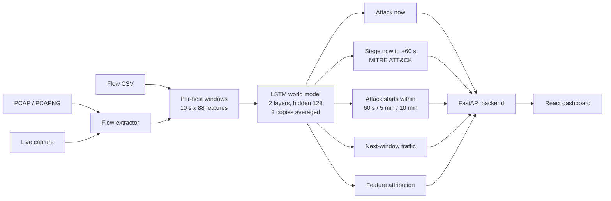

<div align="center">

# CyberForecaster

### AI-Based Network Attack Forecasting from Network Traffic Data

**Smart India Hackathon 2026 · Problem Statement SIH26153 · NTRO**


</div>

---

## Problem statement

| | |
| :--- | :--- |
| **Problem Statement ID** | SIH26153 |
| **Title** | AI-based Network Attack Forecasting from Network Traffic Data |
| **Organization** | National Technical Research Organisation (NTRO) |
| **Theme** | Blockchain & Cybersecurity |
| **Category** | Software |
| **Team** | Ninja · Team ID 143440 |

---

## Overview

Most intrusion-detection systems raise an alarm only after an attack is under way. **CyberForecaster** goes one
step further: it reads network traffic (`.pcap`, `.pcapng`, flow `.csv`, or live capture) and, for every host on
the network, answers three questions.

| Question | What CyberForecaster gives you |
| :--- | :--- |
| **Is this host attacking right now?** | Detection, with a probability for every 10-second window |
| **What will it do next?** | A forecast of the host's stage for each of the next 60 seconds, and the chance that an attack starts within 60 seconds, 5 minutes and 10 minutes |
| **Which stage of the attack is it in?** | The MITRE ATT&CK stage: reconnaissance, initial access, command & control, lateral movement or exfiltration |

At its core is an LSTM **world model**. Instead of only classifying traffic as good or bad, it learns how a host's
traffic evolves over time and predicts what that traffic will look like next. That is what lets it forecast, not
just detect.

Every result is explainable: the dashboard shows which traffic features pushed the risk up or down, along with
the actual flows behind the alert.

---

## Results

World model v5 · 3 copies averaged · measured on **hours held back from training** (299,632 host-windows).

| What | Result |
| :--- | :---: |
| Attack detection (attack within 60 s) | **F1 0.945 · AUROC 0.998** |
| Precision / recall | 93.9% / 95.2% |
| False-alarm rate | **0.55%** |
| MITRE stage naming (6 classes) | **macro-F1 0.842** |
| 5-minute "attack is about to start" warning | **91.8% precision** |
| Trained on | 2,233,318 host-windows · 6 public datasets · 88 features |
| Upload to result | 5–21 seconds for a 3–42 MB file on a laptop CPU |

### Comparison with baselines

| Measure | Logistic regression | XGBoost | **World model (ours)** | World model + XGBoost (hybrid) |
| :--- | :---: | :---: | :---: | :---: |
| Detection F1 | 0.833 | 0.969 | **0.945** | 0.956 |
| False-alarm rate | 1.73% | 0.36% | **0.55%** | 0.64% |
| AUROC | 0.984 | 0.999 | **0.998** | 0.999 |
| Attack starts warned 60 s ahead (of 47) | 8 | 8 | **13** | 17 |
| Precision of those warnings | 0.4% | 2.2% | **9.2%** | 4.0% |
| 5-minute warning: precision | – | 64.2% | **91.8%** | – |
| Names the MITRE ATT&CK stage | ✗ | ✗ | **✓** | ✓ |
| Forecasts the stage for the next 60 s | ✗ | ✗ | **✓** | ✓ |
| Predicts the host's next traffic window | ✗ | ✗ | **✓** | ✓ |

- **Detection:** XGBoost is slightly ahead at spotting an attack that is already happening (0.969 against 0.945).
  It returns one yes/no score and nothing else.
- **Forecasting:** the world model warns about more attack starts than either baseline (13 against 8), at four
  times the precision of XGBoost. Its 5-minute warning is right 92 times out of 100, against 64 for XGBoost.
- **Hybrid:** averaging our model with XGBoost warns about the most attack starts (17 of 47) at lower precision.
  It is measured here for reference; the dashboard runs the world model alone.
- Logistic regression on the last window only (no history) reaches F1 0.615, which shows how much the history matters.

### Forecasting in detail

| Warning horizon | Precision | Recall |
| :--- | :---: | :---: |
| Attack starts within 60 seconds | 9.2% | 13 of 47 starts |
| Attack starts within 5 minutes | **91.8%** | 34.3% |
| Attack starts within 10 minutes | 65.3% | 26.9% |


##  What makes CyberForecaster different?

**1. Trained on real multi-stage APT campaigns.**
Besides the standard intrusion datasets, the model learns from DAPT2020 and Unraveled, where one attacker moves
through reconnaissance, initial access, lateral movement, command & control and exfiltration over days. Most
systems only see single, isolated attacks.

**2. Forecasts a sequence of stages, not one label.**
For every host it gives the stage at seven points in time (now, +10 s … +60 s), so you see a change coming, for
example "normal now, exfiltration in 10–40 s, normal again after". Each step also shows the second most likely stage.

**3. Follows each host through the attack.**
Forecasts are per host, not one score for the network, so a machine that moves from exfiltration to
command & control is tracked across stages (host `10.1.3.8` in the demo file).

##  Architecture



| Layer | Technology |
| :--- | :--- |
| Model | PyTorch LSTM world model; 88 features per host and 10-second window (73 on what the host sends, 15 on what it receives) |
| Baselines | Logistic regression, XGBoost (same inputs) |
| Backend | Python, FastAPI, Uvicorn, WebSockets, Scapy, dpkt, pandas, NumPy |
| Frontend | React 19, Vite, Tailwind CSS, Recharts, Spline (works offline) |

**Why a world model?**
A classifier answers "is this an attack?". A world model also predicts what the host's
traffic will look like next, so it can say what is coming: the stage for each of the next 60 seconds and the
chance that an attack is about to start.

##  Training datasets

**Public labelled datasets**

- CSE-CIC-IDS2018
- CTU-13
- CIC-IDS2017
- UNSW-NB15

**Multi-stage APT datasets**

- Unraveled
- DAPT2020

---

## 🚀 Setup

**You need:** [Python 3.10+](https://www.python.org/downloads/) (tick *Add python.exe to PATH*) and
[Node.js 18+](https://nodejs.org/). For live capture on Windows also [Npcap](https://npcap.com/#download)
(tick *WinPcap API-compatible Mode*). File upload works without Npcap.

### Windows

Open **PowerShell** and run these one by one:

```powershell
git clone https://github.com/maradiadrashti/cyberforecaster.git
cd cyberforecaster

python -m venv .venv
.venv\Scripts\python -m pip install -r requirements.txt

cd client
npm install
cd ..

Set-ExecutionPolicy -Scope Process -ExecutionPolicy Bypass
.\start.ps1
```

`start.ps1` asks for Administrator permission (needed for live capture). Click **Yes**.
The dashboard opens at **http://127.0.0.1:5173**. Press **Enter** in that window to stop.

**If `start.ps1` does not start** (or you see *"running scripts is disabled"*):

1. Press **Start**, type **PowerShell**, right-click **Windows PowerShell**, choose **Run as administrator**.
2. Go to the project folder (use your own path):
   ```powershell
   cd C:\Users\<you>\cyberforecaster
   ```
3. Allow scripts for this window and start:
   ```powershell
   Set-ExecutionPolicy -Scope Process -ExecutionPolicy Bypass
   .\start.ps1
   ```

### Linux / macOS

```bash
git clone https://github.com/maradiadrashti/cyberforecaster.git
cd cyberforecaster

python3 -m venv .venv
source .venv/bin/activate
pip install -r requirements.txt

cd client && npm install && cd ..

chmod +x start.sh
sudo ./start.sh
```

Open **http://127.0.0.1:5173**. Press **Ctrl + C** to stop.


**Real Time Attack Forecast graph from our dashboard**


---

## 📂 Repository layout

```text
cyberforecaster/
├── capture-service/         backend (FastAPI)
│   ├── capture_server.py    API, upload handling, live capture
│   ├── world_model.py       loads files, builds windows, runs the world model
│   └── extractor/           PCAP → flows
├── client/                  dashboard (React + Vite)
├── models/world_model/      the trained world model (weights, metadata, baseline)
├── training/world_model/    data steps, training script, checks, logs and results of the real runs
├── samples/                 demo and test files to upload
├── docs/                    result reports
├── legacy/                  earlier code and models, not used by the application
├── requirements.txt
└── start.ps1 / start.sh     start backend + dashboard
```

---

## Honest Limitations

**1. First-time attacks are hard to forecast:**

When a host has been normal and then attacks for the first time, the model warned in the minute before in 13 of
47 cases on held-back data. In our test files it warned before a host's first attack in 1 of 7 cases. Many attacks
give no sign in the traffic beforehand, so there is nothing to forecast from.

**2. Stage naming is uneven:**

Command & control, lateral movement and exfiltration are named correctly 96–99% of the time. Initial access is
at 89% and reconnaissance at 68%. Initial access drops to 46% on CSE-CIC-IDS2018.

**3. XGBoost is ahead on plain detection:**

On the same inputs XGBoost reaches F1 0.969 against our 0.945. Our model is ahead on early warning and is the
only one of the two that names stages and forecasts.

**4. Live Telemetry detects only when on the same network interface:**

 live telemetry can only  analyse the traffic that reaches the interface. To put it in simple words, it can only detect traffics coming from the same interface/network.

**5. Input requirements:**

A CSV must contain source IP, destination IP and a time for every flow. A file should hold all traffic of its
time span, because the model also uses what each host receives.

---


##  Dataset References

1. CIC-IDS2017 — https://www.unb.ca/cic/datasets/ids-2017.html
2. CSE-CIC-IDS2018 — https://www.unb.ca/cic/datasets/ids-2018.html
3. CTU-13 — https://www.stratosphereips.org/datasets-ctu13
4. UNSW-NB15 — https://research.unsw.edu.au/projects/unsw-nb15-dataset
5. DAPT2020 — https://gitlab.com/asu22/dapt2020
6. Unraveled — https://gitlab.com/asu22/unraveled
7. MITRE ATT&CK — https://attack.mitre.org

---

<div align="center">

Built for **Smart India Hackathon 2026** · PS **SIH26153** (NTRO) · Team Ninja

</div>
