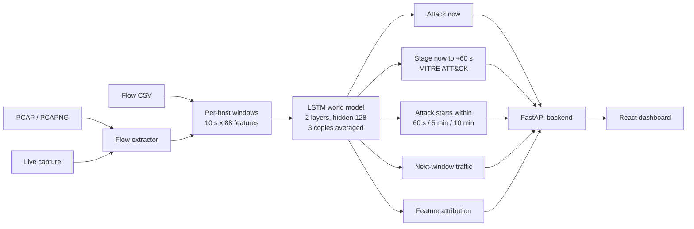

<div align="center">

# 🛡️ CyberForecaster

### AI-Based Network Attack Forecasting from Network Traffic Data

**Smart India Hackathon 2026 · Problem Statement SIH26153 · NTRO**


</div>

---

## 🏷️ Problem statement

| | |
| :--- | :--- |
| **Problem Statement ID** | SIH26153 |
| **Title** | AI-based Network Attack Forecasting from Network Traffic Data |
| **Organization** | National Technical Research Organisation (NTRO) |
| **Theme** | Blockchain & Cybersecurity |
| **Category** | Software |
| **Team** | Ninja · Team ID 143440 |

---

## 📌 Overview

CyberForecaster reads network traffic (`.pcap`, `.pcapng`, flow `.csv`, or live capture) and, for every host,
tells you three things:

1. **Is it attacking now?** (detection)
2. **What will it do in the next 60 seconds, and is an attack about to start?** (forecast)
3. **Which MITRE ATT&CK stage is it in?** Reconnaissance, initial access, command & control, lateral movement or exfiltration.

It does this with an LSTM **world model**: the model learns how a host's traffic evolves and predicts the host's
next traffic window, its stage for each of the next 60 seconds, and the chance that an attack starts within
60 seconds, 5 minutes and 10 minutes. Every result on the dashboard comes with the traffic features that caused it.

---

## 📊 Results at a glance

World model v5 · 3 copies averaged · measured on **hours held back from training** (299,632 host-windows).

| What | Result |
| :--- | :---: |
| Attack detection (attack within 60 s) | **F1 0.945 · AUROC 0.998** |
| Precision / recall | 93.9% / 95.2% |
| False-alarm rate | **0.55%** |
| MITRE stage naming (6 classes) | **macro-F1 0.842** |
| 5-minute "attack is about to start" warning | **91.8% precision** |
| Trained on | 2,233,318 host-windows · 6 public datasets · 88 features |
| Upload to result | 5–21 seconds for a 3–42 MB file on a laptop CPU |

### Detection against baselines (same inputs)

| Model | F1 | False-alarm rate | AUROC |
| :--- | :---: | :---: | :---: |
| Logistic regression, last window only | 0.615 | 6.70% | 0.950 |
| Logistic regression, 10 windows | 0.833 | 1.73% | 0.984 |
| **World model (LSTM)** | **0.945** | **0.55%** | **0.998** |
| XGBoost, 10 windows | 0.969 | 0.36% | 0.999 |

XGBoost is slightly ahead at plain detection. It gives a single yes/no score; it cannot name stages or forecast.

### Forecasting: warning before an attack starts

The host has been normal for its last 10 windows and an attack starts within 60 seconds (47 such attack starts).

| Model | Attack starts warned | Precision of the warnings |
| :--- | :---: | :---: |
| Logistic regression, 10 windows | 8 of 47 | 0.4% |
| XGBoost, 10 windows | 8 of 47 | 2.2% |
| **World model (LSTM)** | **13 of 47** | **9.2%** |
| World model + XGBoost averaged (hybrid, not installed) | 17 of 47 | 4.0% |

The world model warns about more attack starts than either baseline, at four times the precision of XGBoost.

| Longer-range warning (calm host, attack starts later) | Precision | Recall |
| :--- | :---: | :---: |
| Attack starts within 5 minutes | **91.8%** | 34.3% |
| Attack starts within 10 minutes | 65.3% | 26.9% |

### MITRE ATT&CK stage naming

| Stage | Recall |
| :--- | :---: |
| Normal | 99.1% |
| Exfiltration | 98.8% |
| Command & control | 97.0% |
| Lateral movement | 96.5% |
| Initial access | 88.7% |
| Reconnaissance | 67.6% |

### On the demo file (`samples/demo_unraveled_5_stages.csv`)

91,851 real flows from the Unraveled APT dataset, five attack stages, 91 hosts.

| Measure | Result |
| :--- | :---: |
| Attack windows alerted | **94%** |
| Stage named correctly | **97%** |
| The four attacking hosts | ranked 1st to 4th by risk |
| Repeated exfiltration bursts of host 10.1.3.17 (held-back hour): 5-minute warning was up before the burst | **13 of 15** |

Four of the five hours in this file were held back from training; the hour that adds initial access was not.
A version with only held-back hours is `samples/demo_unraveled_heldback.csv` (90% alerted, 96% stage correct).

### Verified end to end

At the v5 release check, every number on the Attack Forecast page was compared with an independent recomputation: 126,105 displayed values
against the backend, 36,019 backend rule checks, and 29,893 model outputs recomputed with separately written code.
No mismatch. Scripts and logs: [`training/world_model/checks/`](training/world_model/checks/).

Full results, per-dataset breakdown and the comparison between model versions:
[`docs/RESULTS_world_model_v5.md`](docs/RESULTS_world_model_v5.md).

---

## 🏗️ Architecture



| Layer | Technology |
| :--- | :--- |
| Model | PyTorch LSTM world model; 88 features per host and 10-second window (73 on what the host sends, 15 on what it receives) |
| Baselines | Logistic regression, XGBoost (same inputs) |
| Backend | Python, FastAPI, Uvicorn, WebSockets, Scapy, dpkt, pandas, NumPy |
| Frontend | React 19, Vite, Tailwind CSS, Recharts, Spline (works offline) |

**Why a world model.** A classifier answers "is this an attack?". A world model also predicts what the host's
traffic will look like next, so it can say what is coming: the stage for each of the next 60 seconds and the
chance that an attack is about to start.

### Training data

| Dataset | In problem statement | Host-windows | Hosts |
| :--- | :---: | ---: | ---: |
| CSE-CIC-IDS2018 | ✅ | 1,218,017 | 32,820 |
| Unraveled | – | 577,727 | 1,768 |
| CTU-13 | ✅ | 172,845 | 89,303 |
| CIC-IDS2017 | ✅ | 132,327 | 5,090 |
| UNSW-NB15 | ✅ | 117,963 | 43 |
| DAPT2020 | – | 14,439 | 129 |

Split by 1-hour blocks: about 60% train, 20% validation, 20% test. A test hour never shares its hour with training.
How to rebuild and retrain: [`training/world_model/README.md`](training/world_model/README.md).

---

## 🚀 Setup

**You need:** [Python 3.10+](https://www.python.org/downloads/) (tick *Add python.exe to PATH*) and
[Node.js 18+](https://nodejs.org/). For live capture on Windows also [Npcap](https://npcap.com/#download)
(tick *WinPcap API-compatible Mode*). File upload works without Npcap.

### Windows

Open **PowerShell** and run these one by one:

```powershell
git clone https://github.com/maradiadrashti/cyberforecaster.git
cd cyberforecaster

python -m venv .venv
.venv\Scripts\python -m pip install -r requirements.txt

cd client
npm install
cd ..

Set-ExecutionPolicy -Scope Process -ExecutionPolicy Bypass
.\start.ps1
```

`pip install -r requirements.txt` downloads every Python dependency (PyTorch is large; allow a few minutes).
`start.ps1` uses the `.venv` automatically, so you do not have to activate it.

`start.ps1` asks for Administrator permission (needed for live capture). Click **Yes**.
The dashboard opens at **http://127.0.0.1:5173**. Press **Enter** in that window to stop.

**If `start.ps1` does not start** (or you see *"running scripts is disabled"*):

1. Press **Start**, type **PowerShell**, right-click **Windows PowerShell**, choose **Run as administrator**.
2. Go to the project folder (use your own path):
   ```powershell
   cd C:\Users\<you>\cyberforecaster
   ```
3. Allow scripts for this window and start:
   ```powershell
   Set-ExecutionPolicy -Scope Process -ExecutionPolicy Bypass
   .\start.ps1
   ```

**Next time** you only need `cd cyberforecaster`, the `Set-ExecutionPolicy` line and `.\start.ps1`.

### Linux / macOS

```bash
git clone https://github.com/maradiadrashti/cyberforecaster.git
cd cyberforecaster

python3 -m venv .venv
source .venv/bin/activate
pip install -r requirements.txt

cd client && npm install && cd ..

chmod +x start.sh
sudo ./start.sh
```

Open **http://127.0.0.1:5173**. Press **Ctrl + C** to stop.

### Start by hand (any OS)

If you prefer two terminals instead of the start script (virtual environment active in the first):

```bash
# Terminal 1: backend
cd capture-service
python -m uvicorn capture_server:app --host 127.0.0.1 --port 8080
```

```bash
# Terminal 2: dashboard
cd client
npm run dev
```

No GPU is needed. Internet is needed only once, for the two install commands.

---

## ▶️ Try it

1. Open the dashboard and go to **File Upload**.
2. Upload **`samples/demo_unraveled_5_stages.csv`** (18 MB, takes under 30 seconds).
3. Go to **Attack Forecast** and pick a host:

| Host | What you see |
| :--- | :--- |
| `10.8.10.87` | Reconnaissance, alerted in every window |
| `10.1.3.8` | Exfiltration on 22 June, then command & control from 25 June: a real stage change |
| `10.1.3.17` | Repeating exfiltration bursts. The forecast rises before each burst. |
| `192.168.0.11` | Lateral movement |

Other files: [`samples/`](samples/README.md). Without the dashboard:

```bash
python capture-service/world_model.py samples/demo_unraveled_5_stages.csv
```

---

## 🖥️ The dashboard

| Page | What you get |
| :--- | :--- |
| **File Upload** | Upload `.pcap` / `.pcapng` / `.csv`. The world model scores every source host. |
| **Attack Forecast** | The full result for one host (below). |
| **Live Telemetry** | Capture from a network interface: live traffic rate, topology, per-flow labels, and download of the captured traffic as PCAP or CSV. |

**Attack Forecast, top to bottom**

| Part | What it shows |
| :--- | :--- |
| **Threat level** | HIGH RISK, ELEVATED, WATCH or NORMAL, with the reason ("attack in progress now", "attack expected within 60 s") |
| **Attack probability** | Chance of an attack in the next 60 seconds, with the 5- and 10-minute values |
| **Stage confidence** | How sure the model is about the stage it names |
| **Risk forecast graph** | Solid blue: what the model detected in the traffic of the file. Dashed gold: its forecast for the next 60 seconds. Red bands: the true labels in the file, for checking. Hover any point for details. |
| **Stage progression tree** | The model's stage from NOW to +60 s as a tree over time: the most likely stage and the other possibility for each time span |
| **MITRE ATT&CK mapping** | Tactic and technique for each time span |
| **Feature attribution** | Which traffic features pushed the risk up or down |
| **Recommended actions / evidence** | Suggested firewall steps and the actual flows |

---

## 📂 Repository layout

```text
cyberforecaster/
├── capture-service/         backend (FastAPI)
│   ├── capture_server.py    API, upload handling, live capture
│   ├── world_model.py       loads files, builds windows, runs the world model
│   └── extractor/           PCAP → flows
├── client/                  dashboard (React + Vite)
├── models/world_model/      the trained world model (weights, metadata, baseline)
├── training/world_model/    data steps, training script, checks, logs and results of the real runs
├── samples/                 demo and test files to upload
├── docs/                    result reports
├── legacy/                  earlier code and models, not used by the application
├── requirements.txt
└── start.ps1 / start.sh     start backend + dashboard
```

---

## 🧭 Scope and next steps

- **Forecasting is strongest for attacks that repeat on a host.** Warning before a host's very first attack is the
  hardest case (13 of 47 on held-back data) and the main thing we are improving.
- **Results are measured on networks the model was trained on** (held-back hours). On a network it has never seen,
  detection drops; adapting to a new network is the next step.
- **Datasets:** four of the seven named in the problem statement are used, plus two APT datasets (DAPT2020, Unraveled).
  LANL, DARPA 1999 and CICIoT2023 are not used yet.
- **DDoS** is detected as an attack but has no stage of its own in the model.
- **Live Telemetry** uses the earlier live models (a per-flow classifier and a 5-flow stage model); moving it to the
  world model is the next step.
- A CSV needs source IP, destination IP and a time per flow. A file should contain all traffic of its time span.

Details and per-dataset numbers: [`docs/RESULTS_world_model_v5.md`](docs/RESULTS_world_model_v5.md).

---

## 🔌 Main API endpoints

| Method | Endpoint | Purpose |
| :--- | :--- | :--- |
| `POST` | `/api/upload` | Upload a PCAP/CSV, run the world model, return the hosts and conversations |
| `GET` | `/api/v2/forecast/latest` | Full world-model result of the last upload (graph, stages, attribution, self-check) |
| `GET` | `/api/forecast/latest` | Conversation list of the last upload |
| `POST` | `/api/forecast/reset` | Clear the last upload |
| `GET` | `/api/interfaces` | Network interfaces available for capture |
| `POST` | `/api/capture/start/{iface}` · `/api/capture/stop/{iface}` | Start / stop live capture |
| `GET` | `/api/capture/export-pcap` · `/api/capture/download` | Download captured traffic |
| `WS` | `/ws/live` | Live flow and forecast stream |

Full list: http://127.0.0.1:8080/docs while the backend is running.

---

## 🛠️ Troubleshooting

| Problem | Fix |
| :--- | :--- |
| `.\start.ps1 : The term ... is not recognized` | You are not inside the project folder. `dir` must show `start.ps1`. |
| *"running scripts is disabled on this system"* | Run `Set-ExecutionPolicy -Scope Process -ExecutionPolicy Bypass` in the same window, then retry. |
| `python` or `npm` is not recognized | Install Python 3.10+ / Node.js 18+, then open a **new** PowerShell window. |
| `.\start.ps1` closes at once or nothing opens | Open **Windows PowerShell as Administrator**, `cd` into the project folder and run it there (see *If `start.ps1` does not start* above). |
| No interfaces / capture won't start (Windows) | Install **Npcap** with *WinPcap API-compatible Mode* and run `start.ps1` as Administrator. |
| Port 8080 or 5173 already in use | `start.ps1` frees them automatically; otherwise stop the other program. |
| Dashboard opens but uploads fail | The backend stopped. Close the start window and run `.\start.ps1` again. Errors are in `logs\capture.err`. |
| Upload is refused | The message says why (for a CSV: no source IP, destination IP or flow time). |
| Attack Forecast is empty | Upload a file on **File Upload** first. |

---

## 📚 References

1. I. Sharafaldin, A. H. Lashkari, A. A. Ghorbani, *"Toward Generating a New Intrusion Detection Dataset and Intrusion Traffic Characterization"*, ICISSP 2018 (CIC-IDS2017 / CSE-CIC-IDS2018).
2. S. García, M. Grill, J. Stiborek, A. Zunino, *"An empirical comparison of botnet detection methods"*, Computers & Security 45, 2014 (CTU-13).
3. N. Moustafa, J. Slay, *"UNSW-NB15: a comprehensive data set for network intrusion detection systems"*, MilCIS 2015.
4. S. Myneni et al., *"DAPT 2020 — Constructing a Benchmark Dataset for Advanced Persistent Threats"*, Springer 2020.
5. S. Myneni et al., *"Unraveled — A semi-synthetic dataset for Advanced Persistent Threats"*, Computer Networks 227, 2023.
6. MITRE ATT&CK® — https://attack.mitre.org

---

<div align="center">

Built for **Smart India Hackathon 2026** · PS **SIH26153** (NTRO) · Team Ninja

</div>
